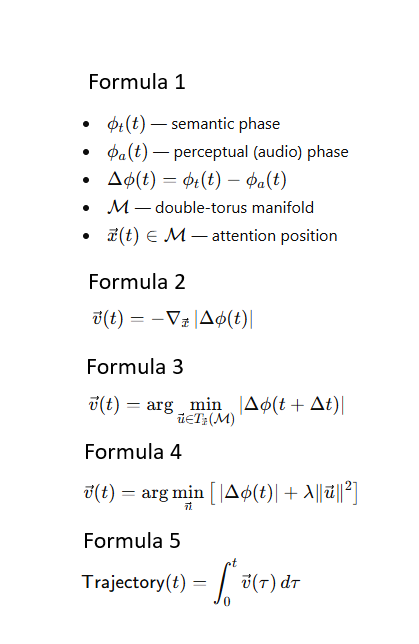

# 🌐 Follower Algorithm on a Double-Torus Manifold
*A compact mathematical formulation of phase-coherent attention dynamics*

This repository presents a minimal, self-contained mathematical model of **phase-coherent attention**.  
Attention is represented as a trajectory on a **double-torus Möbius manifold**, driven by minimizing instantaneous phase mismatch between:

- semantic phase (text)
- perceptual phase (audio / prosody)

This produces interpretable trajectories that reveal how attention resolves semantic–prosodic conflicts and converges toward coherence.

---

## 🧮 Core Formulas of the Model

The entire model is defined by the following five equations:

  

---

## 🧩 Interpretation

- **Formula 1** defines the semantic–perceptual phase variables and the double-torus manifold.  
- **Formula 2** introduces the phase-discrepancy vector field.  
- **Formula 3** defines the Follower’s optimal local motion.  
- **Formula 4** incorporates an energy (effort) constraint.  
- **Formula 5** generates the full attention trajectory as a smooth integral curve.

Together, these equations produce a continuous dynamical system on a 2-cycle manifold.

---

## 🧠 Conceptual Motivation

Biological attention is a **phase-alignment process** between:

- low-frequency semantic cycles (left hemisphere)  
- high-frequency perceptual cycles (right hemisphere)

Representing them as a **double torus** yields a natural geometric model of inter-hemispheric coordination.  
The Follower trajectory corresponds to the direction of **maximal instantaneous coherence**, analogous to predictive minimization in the brain.

---

## 📁 Output (Important)

⚠️ *This script does not display any graphics on screen.*

All generated frames are saved automatically into:

